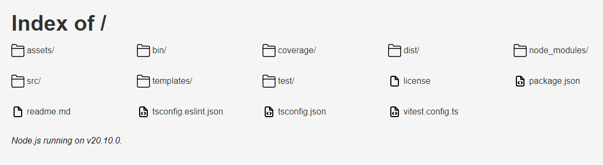

# serw 🥽 

Serve static files with ease. 🎆

## Getting Started

Easiest way to get started is by just typing `npx serw` which will start a static HTTP server from your current directory.



> ⚠ By default serw will attempt to find `public` directory and serve files from there. To avoid this behavior type `serw .`.

Alternatively, you can manually install the package globally:

```bash
npm i serw --global
```

...and then run it in your project's directory:

```bash
serw folder-name/ [options]
```

## Features

* 🛡️ Integration with SSL/TLS certificate.
* 🌐 ETag, CORS, Cache-Control headers.
* 🔒 Basic password authentication.
* 📁 Ignore files with support for globs.
* 🚨 Customizable HTTP error handlers

## Configuration

To show a full list of available options run `serw --help`.\
Every option can be negated with `--no` prefix, e.g. `--no-open` or `-o=false`.

> 💡 You can also configure serw with `serw.json` file.

For now this package is only a CLI tool and has no built-in programmatic integration yet. I recommend against using `serw` in production and only using it in development.

## Options

### `--host, -H`

Type: `string`\
Default: `localhost`

Hostname to bind.

### `--port, -p`

Type: `number`\
Default: `3000`

Port to bind.

### `--index, -m`

Type: `string`\
Default: `index.html`

Path to the main page file.

### `--dot-files, -d`

Type: `boolean`\
Default: `false`

Show dot files, e.g. `.env`.

### `--ignore-files, -i`

Type: `array`

List of files to ignore.

### `--dir-listing, -l`

Type: `boolean`\
Default: `true`

Enable directory listing.
<details>
    <summary>Click to show an example.</summary>
    
</details>

### `--error-page, -E`

Type: `string`\
Default: `404.html`

Path to a file to display when an error occurred.

### `--open, -o`

Type: `boolean`\
Default: `true`

Whether to open browser window after the server starts.

### `--robots, -r`

Type: `boolean`\
Default: `false`

Automatically handle [`/robots.txt`](https://en.wikipedia.org/wiki/Robots.txt).

### `--cors, -c`

Type: `boolean`\
Default: `false`

Enable CORS headers.

### `--etag, -e`

Type: `boolean`\
Default: `false`

Enable ETag headers.

### `--max-age, -M`

Type: `number`\
Default: `undefined`

Enable Cache-Control header and set `maxAge` (seconds).

### `--immutable, -I`

Type: `boolean`\
Default: `false`

Appends Cache-Control header with `immutable`.

### `--password, -p`

Type: `string`

Enable simple authentication via a password.

### `--ssl, -s`

Type: `boolean`\
Default: `false`

Enable SSL/TLS for HTTPS.

### `--key, -K`

Type: `string`\
Default: `key.pem`

Path to SSL certificate key.

### `--cert, -C`

Type: `string`\
Default: `cert.pem`

Path to SSL certificate file.

### `--config`

Type: `string`\
Default: `serw.json`

Path to the config json file.

### `--log-ip`

Type: `boolean`\
Default: `false`

Log IP address of the client's request.

### `--log-agent`

Type: `boolean`\
Default: `false`

Log User-agent of the client's request.

### `--log-timestamp`

Type: `boolean`\
Default: `true`

Log timestamp.

### `--clear-console`

Type: `boolean`\
Default: `true`

Clear console after the server starts.

### `--silent`

Type: `boolean`\
Default: `false`

Disable logging entirely.

## License

MIT 💖